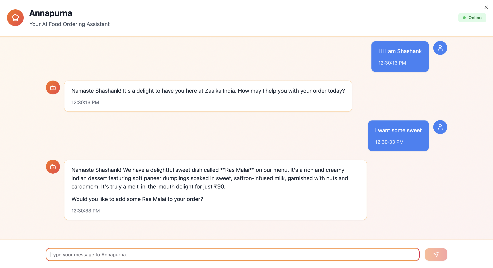
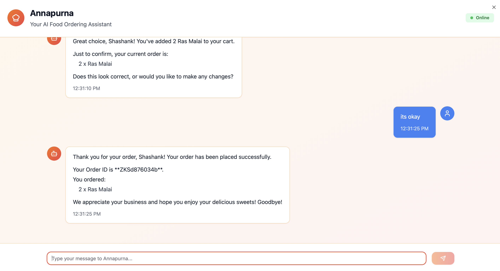
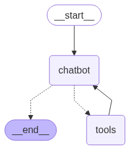

# Annapurna (ChatBot Agent) - Food Ordering System

Annapurna is a sophisticated GenAI-powered conversational agent built with LangGraph and FastAPI that helps customers browse restaurant menus and place orders seamlessly in natural language. This project demonstrates the power of AI agents in creating natural, intuitive food ordering experiences with some creative human like conversations, not the old robotic chatbots.

## 📱 Application Screenshots

### Chat Interface


_Main chat interface showing natural language interaction_

### Menu Browsing & Cart Management


_Dynamic menu display and cart management features_

## 🌟 Features

- **Intelligent Conversational Interface**: Natural language interaction for menu browsing and order placement
- **Dynamic Menu Integration**: Real-time menu fetching from external services
- **Smart Cart Management**: Add, modify, and track items in the shopping cart
- **Multi-tenant Support**: Support for multiple restaurant subdomains
- **Memory-Enabled Conversations**: Maintains context throughout the ordering session
- **RESTful API**: Clean API endpoints for frontend integration
- **Extensible Architecture**: Built with LangGraph for easy workflow modifications

## 🏗️ Architecture

This project uses a modern AI agent architecture:

- **LangGraph**: Orchestrates the conversational workflow and agent behavior
- **FastAPI**: Provides high-performance REST API endpoints
- **LangChain**: Powers the LLM integration and tool calling
- **Google Gemini**: LLM backend for natural language processing

### Agent Workflow

The system implements a state-based conversational agent that:

1. Receives user messages
2. Processes intent and context
3. Calls appropriate tools (menu fetching, cart management)
4. Maintains conversation state and memory
5. Responds with helpful, contextual information


_Agent workflow visualization showing the conversation flow and tool integration_

## 📁 Project Structure

```
chatbot-agent/
├── backend/                    # Main backend application
│   ├── src/
│   │   ├── agents/            # Agent-related modules
│   │   │   ├── nodes/         # LangGraph nodes (chatbot, tools)
│   │   │   ├── prompts/       # System prompts and templates
│   │   │   ├── tools/         # Agent tools (cart, menu)
│   │   │   ├── graph.py       # LangGraph workflow definition
│   │   │   ├── state.py       # State management
│   │   │   └── output_structures.py
│   │   ├── api/               # FastAPI routes
│   │   │   └── routes/        # API endpoint definitions
│   │   ├── services/          # Business logic services
│   │   ├── configs/           # Configuration management
│   │   └── main.py           # FastAPI application entry point
│   ├── pyproject.toml        # Python dependencies
│   └── uv.lock              # Lock file for reproducible builds
├── training/                  # Training and development notebooks
│   ├── training-agent.ipynb  # Jupyter notebook for agent development
│   ├── menu.json            # Sample menu data
│   └── main.py              # Training scripts
├── docs/                     # Documentation and diagrams
│   ├── langgraph-flow.png   # Workflow visualization
│   └── screenshots/         # Application screenshots
└── README.md                # This file
```

## 🚀 Quick Start

### Prerequisites

- Python 3.12+
- UV package manager (recommended) or pip
- Environment variables for API keys

### Installation

1. **Clone the repository**

   ```bash
   git clone https://github.com/shashanksrajak/chatbot-agent-food-ordering.git
   cd chatbot-agent-food-ordering
   ```

2. **Set up the backend environment**

   ```bash
   cd backend
   uv sync  # or pip install -e .
   ```

3. **Configure environment variables**
   Create a `.env` file in the backend directory:

   ```env
   GOOGLE_API_KEY=your_google_api_key
   MENU_BACKEND_URL=your_menu_service_url
   ```

4. **Run the application**

   ```bash
   cd backend
   uvicorn src.main:app --reload
   ```

   The API will be available at `http://localhost:8000`

### API Documentation

Once running, access the interactive API documentation at:

- Swagger UI: `http://localhost:8000/docs`
- ReDoc: `http://localhost:8000/redoc`

## 🛠️ Usage

### Basic Chat Interaction

```bash
curl -X POST "http://localhost:8000/chat" \
     -H "Content-Type: application/json" \
     -d '{
       "message": "Hi, I want to see your menu",
       "subdomain": "restaurant1",
       "restaurant_name": "name",
       "session_id": "user123"
     }'
```

### Example Conversation Flow

1. **User**: "Hi, what's on your menu today?"
2. **Agent**: Fetches and displays the current menu
3. **User**: "I'd like to add a margherita pizza to my cart"
4. **Agent**: Adds the item and confirms the addition
5. **User**: "What's in my cart now?"
6. **Agent**: Shows current cart contents and total

## Development

### Running in Development Mode

```bash
# Backend with auto-reload
cd backend
uvicorn src.main:app --reload --host 0.0.0.0 --port 8000

# For development with detailed logging
uvicorn src.main:app --reload --log-level debug
```

### Training and Experimentation

The `training/` directory contains Jupyter notebooks for:

- Agent behavior experimentation
- Prompt engineering
- Menu data preprocessing
- Workflow testing

```bash
cd training
jupyter notebook training-agent.ipynb
```

## 🧪 Key Components

### Agent Tools

- **`get_menu()`**: Fetches real-time menu data from external services
- **`add_to_cart()`**: Manages cart item additions with validation
- **`view_cart()`**: Displays current cart contents
- **`remove_from_cart()`**: Handles item removal and modifications

### State Management

The agent maintains conversation state including:

- Current cart contents
- User preferences
- Conversation history
- Restaurant context (subdomain)

### Memory System

Built-in memory management ensures:

- Context preservation across messages
- Session-based conversation tracking
- Stateful interactions

## 📝 License

This project is licensed under the MIT License - see the [LICENSE](LICENSE) file for details.

## 🙏 Acknowledgments

- **LangChain & LangGraph**: For the powerful agent framework
- **FastAPI**: For the high-performance web framework
- **Google Gemini**: For the LLM capabilities
- **Supabase**: For the backend infrastructure

## 📧 Contact

**Shashank Rajak** - [@shashanksrajak](https://github.com/shashanksrajak)

Project Link: [https://github.com/shashanksrajak/chatbot-agent-food-ordering](https://github.com/shashanksrajak/chatbot-agent-food-ordering)

---

_Built with ❤️ using LangGraph and FastAPI_
